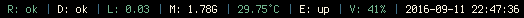
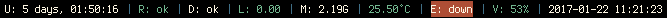

## Goblocks

Goblocks is an [i3status](https://i3wm.org/i3status/) replacement written in [Go](https://golang.org/), using the [Go-i3barjson](https://github.com/davidscholberg/go-i3barjson) library to communicate with [i3bar](https://i3wm.org/i3bar/).

The main goal of this project is to match most of the features of [i3blocks](https://github.com/vivien/i3blocks) while keeping all of the modules written in pure Go. This will keep Goblocks fast and lightweight, allowing the user to configure Goblocks with a very high update frequency without fear of taking up excessive system resource and battery.

### Features

* Status indicators for:
    * RAID status (mdraid only)
    * filesystem usage
    * system load
    * memory availability
    * CPU temperature
    * network interfaces
    * wifi signal strength
    * battery level
    * volume (ALSA only)
    * date/time
* Configuration in [YAML](http://yaml.org/) format (see [config/goblocks-full.yml](config/goblocks-full.yml)).
* Color support.
* Ability to configure separate refresh intervals for each individual block.
* Ability to configure UNIX signal handlers to refresh individual blocks.
* Ability to reload the configuration by sending the HUP signal (e.g. `pkill -HUP goblocks`).
* Debug option to [pretty-print](https://en.wikipedia.org/wiki/Prettyprint) Goblocks' JSON output.

Below is an example of what the configuration at [config/goblocks-screenshot.yml](config/goblocks-screenshot.yml) might look like:



This is an example of what a block that's gone critical might look like:



### Install

Gobocks requires Go version 1.7+.

Install Goblocks and the sample config file:

```bash
go get github.com/davidscholberg/goblocks
mkdir -p $HOME/.config/goblocks
cp $GOPATH/src/github.com/davidscholberg/goblocks/config/goblocks-full.yml $HOME/.config/goblocks/goblocks.yml
```

### Configure

Goblocks configuration is specified in [YAML](http://yaml.org/). The configuration file path is `$HOME/.config/goblocks/goblocks.yml`. A full configuration example with all available block types and options can be found at [config/goblocks-full.yml](config/goblocks-full.yml).

### Run

To use Goblocks in your i3bar, add the Goblocks binary to the [bar section of your i3 config](https://i3wm.org/docs/userguide.html#_configuring_i3bar). Note that if `$GOPATH/bin/` is not in your `$PATH` variable, then you'll have to specify the full path to the Goblocks binary.

You can reload Goblocks' configuration without restarting i3 by sending the `HUP` signal to Goblocks:

```bash
pkill -HUP goblocks
```

You can debug Goblocks' output by running it on the command line. If you set the `debug` [config option](config/goblocks-full.yml) to true, then Goblocks will [pretty-print](https://en.wikipedia.org/wiki/Prettyprint) the JSON output, making it easier to read.

### Contributing

If you would like to see a new feature or enhancement in Goblocks, please feel free to submit an [issue](/../../issues) or [pull request](/../../pulls).

### TODO

* Fix temperature block to search for correct path.
* Add global option for default update interval.
* Add key indicator block.
* Add software update block.
* Update README with instructions for adding modules.
